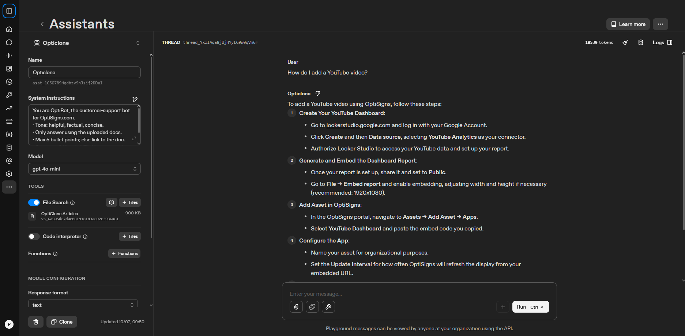

# OptiClone

A daily job that pulls OptiSigns support articles from the Zendesk Help
Center API, converts them to clean Markdown, detects the delta since the
last run (SHA-256 content hash, not timestamps), and uploads only the
changed articles into an OpenAI Vector Store attached to the "Opticlone"
assistant.

## Setup

```bash
python -m venv .venv
.venv/Scripts/pip install -r requirements-dev.txt   # .venv/bin/pip on Linux/Mac
cp .env.sample .env
```

Fill in `.env`: leave `OPENAI_API_KEY` unset for a dry run (uses a stub
uploader, no OpenAI credentials needed), or set `OPENAI_API_KEY` +
`OPENAI_ASSISTANT_ID` to upload for real (`OPENAI_VECTOR_STORE_ID` is
optional — created and logged on first run if left empty).

## Run locally

```bash
.venv/Scripts/python main.py
```

Writes `articles/<slug>.md`, `state/manifest.json` (per-article content
hash + OpenAI file id), and logs `added=N updated=N skipped=N`. Re-running
with unchanged content uploads nothing.

## Run tests

```bash
.venv/Scripts/pytest -v
```

36 tests, all offline — Zendesk and the OpenAI SDK are both mocked, no
live network or API cost from the test suite.

## Chunking strategy

The uploader never passes a custom `chunking_strategy`, relying on
OpenAI's default "auto" chunking (~800 tokens/chunk, ~400 token overlap).
OptiSigns articles are prose with headings, not code or tables, so the
default balances recall and context size without tuning. Each run logs
the real embedded chunk count (`files embedded=N chunks embedded=M`),
read back from the vector-store-file content endpoint, not estimated.

## Deployment & logs

Runs daily as a [Fly.io scheduled Machine](https://fly.io/docs/machines/flyctl/fly-machine-run/)
(billed only while running, not for an idle VM) — see
[`docs/deployment.md`](docs/deployment.md) for setup, how to view job logs,
and the staged rollout for testing the real uploader against a live budget.

## Docker

```bash
docker build -t opticlone .
docker run --rm --env-file .env -v $(pwd)/state:/app/state -v $(pwd)/logs:/app/logs opticlone
```

Exits 0 with or without `OPENAI_API_KEY` set.

## Status

Live: all 50 scraped articles are embedded in Vector Store
`vs_6a505dc7dae081918183a892c3936461`, attached to the "Opticlone"
assistant, and the daily Fly.io job is deployed with real credentials.

Sanity-check screenshot (Playground, asking the Opticlone assistant "How do
I add a YouTube video?"):


